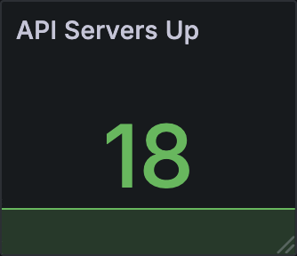

# grafana-react

React-based DSL for creating Grafana dashboards. Write dashboards as JSX components and compile them to Grafana JSON.

<p align="center">
  
  &nbsp;&nbsp;&nbsp;
  
</p>

## Features

- **Declarative JSX Syntax** - Write dashboards using familiar React patterns
- **Component Composition** - Create reusable dashboard components
- **Type Safety** - Full TypeScript support with comprehensive types
- **CLI Tool** - Build, validate, and watch dashboard files
- **Zero Runtime** - Compiles to static JSON, no React in production

## Installation

```bash
npm install grafana-react react
```

## Quick Start

```tsx
import { Dashboard, Row, Stat, Timeseries, Variable } from 'grafana-react';

export default function MyDashboard() {
  return (
    <Dashboard uid="my-dashboard" title="My Dashboard" datasource="prometheus">
      <Variable name="instance">label_values(up, instance)</Variable>

      <Row title="Summary">
        <Stat
          title="CPU %"
          unit="percent"
          thresholds={{ 70: 'yellow', 90: 'red' }}
        >
          100 - avg(rate(cpu_idle[$__rate_interval])) * 100
        </Stat>
      </Row>

      <Row title="Details">
        <Timeseries title="CPU Over Time" unit="percent" stack legend="right">
          sum(rate(node_cpu_seconds_total[5m])) by (mode) * 100
        </Timeseries>
      </Row>
    </Dashboard>
  );
}
```

Build to JSON using the CLI:

```bash
grafana-react build my-dashboard.tsx output/my-dashboard.json
```

Or programmatically with `renderToString`:

```ts
import React from 'react';
import { renderToString } from 'grafana-react';

// Use the JSON string directly, e.g. add as a ConfigMap with Pulumi
const json = renderToString(React.createElement(MyDashboard));
```

## Documentation

Full documentation is available at: **[kiwi-research.github.io/grafana-react](https://kiwi-research.github.io/grafana-react)**

- [Getting Started](https://kiwi-research.github.io/grafana-react/getting-started/installation/)
- [Components Reference](https://kiwi-research.github.io/grafana-react/components/structure/)
- [CLI Usage](https://kiwi-research.github.io/grafana-react/guides/cli-usage/)
- [Reusable Components](https://kiwi-research.github.io/grafana-react/guides/reusable-components/)

## CLI Commands

```bash
grafana-react build <input.tsx> [output.json]     # Build single dashboard
grafana-react build-all <dir> [output-dir]        # Build all dashboards
grafana-react validate <input.tsx>                # Validate without output
grafana-react watch <dir> [output-dir]            # Watch and rebuild
```

## License

MIT
